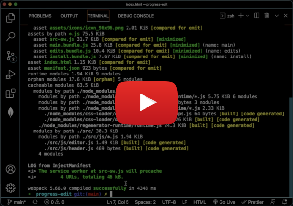
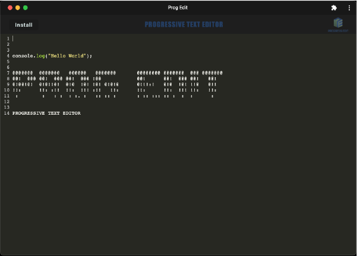

# progress-edit


## Table of Contents

- [Description](#description)
- [User Story](#user-story)
- [Installation](#installation)
- [Deployment](#deployment)
- [License](#license)
- [Demo](#demo)
- [Criteria](#criteria)

<br />
<br />

## Description

Progress Edit is not only a text editor that runs in the browser, but it is also a Progressive Web App with a number of data persistence measures serving as redundancy in case one of the options is not supported by the browser, or online connectivity is lost. The app uses the `idb` package methods to get and store data to an IndexedDB database.

<br />
<br />

## User Story

```
AS A developer
I WANT to create notes or code snippets with or without an internet connection
SO THAT I can reliably retrieve them for later use
```

<br />
<br />

## Installation

⬇️

Must first initialize with the following commands:

```
npm i

npm run build
```

<br />

Application will then run in the command-line with:

```
npm run dev
```

<br />
<br />

## Deployment

[](https://progress-edit.herokuapp.com/)

<br />

**Employing the following technology:**

[](https://nodejs.org/en/) [](https://www.npmjs.com/package/express) [](https://webpack.js.org/)  
[](https://developer.mozilla.org/en-US/docs/Web/API/IndexedDB_API) [](https://babeljs.io/)

<br />
<br />

## License

Copyright (c) David Dyer [2022]

[](https://choosealicense.com/licenses/isc/)

<br />
<br />

## Demo

[](https://youtu.be/XG3Ww3qS-2s)

<br />



<br />
<br />

## Criteria

✅

```
when opening app in editor, user presented with client-server folder structure.

commanding `npm run dev` from root directory starts backend and serves client.

running app from terminal will bundle js files using webpack.

webpack plugins generate html file, service worker, and manifest file.

with next-gen js applied, app still functions in browser with no error.

when opening text editor, idb immediately creates database storage.

user enters content and clicks off dom window, content is saved with idb.

reopening app after closing, will display content retrieved from idb.

clicking install button will download app as an icon on user desktop.

loaded web app will have registered service worker using workbox.

after service worker registration, user has static assets pre-cached upon loading.

deploying to heroku has proper build scripts for webpack.

```

<br />
<br />
<br />
Let's build something!

🛠️
